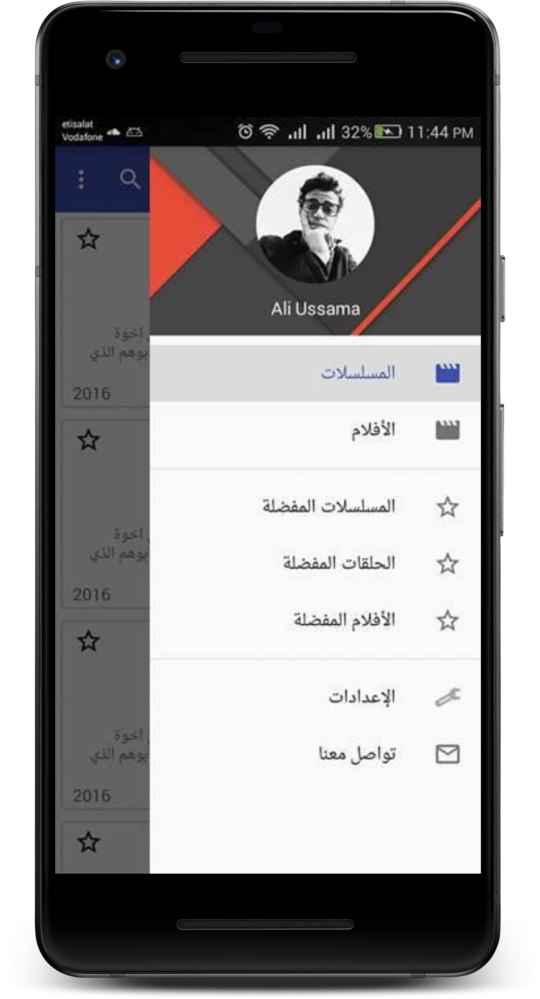
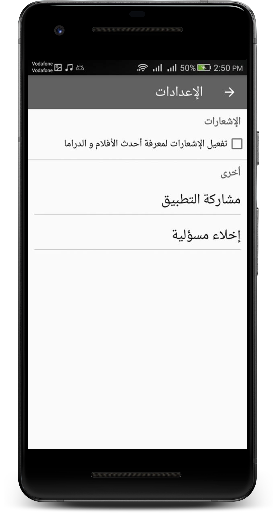
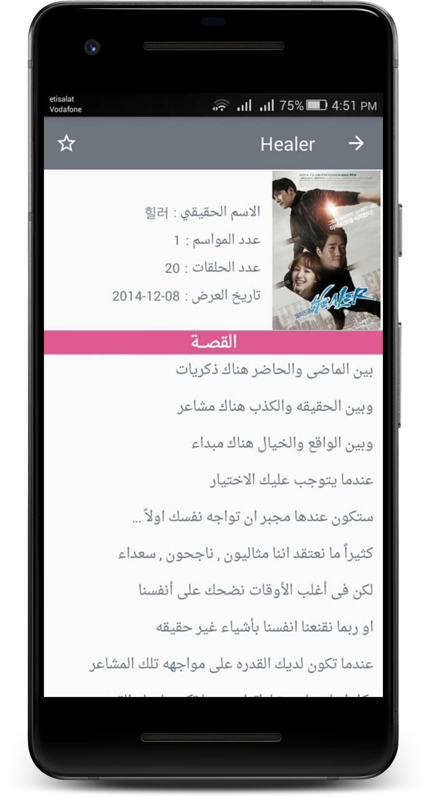
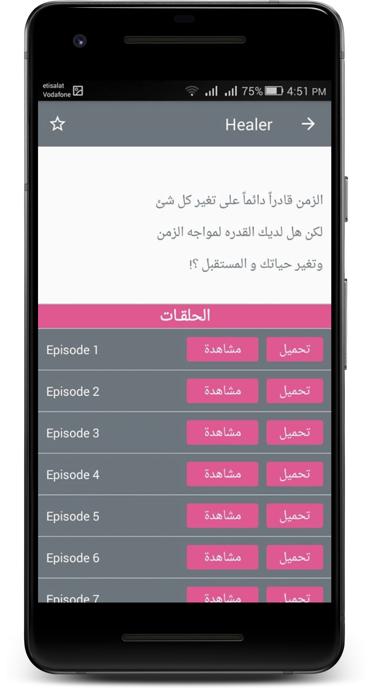
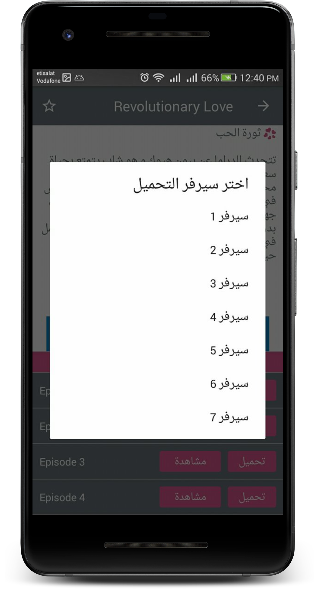
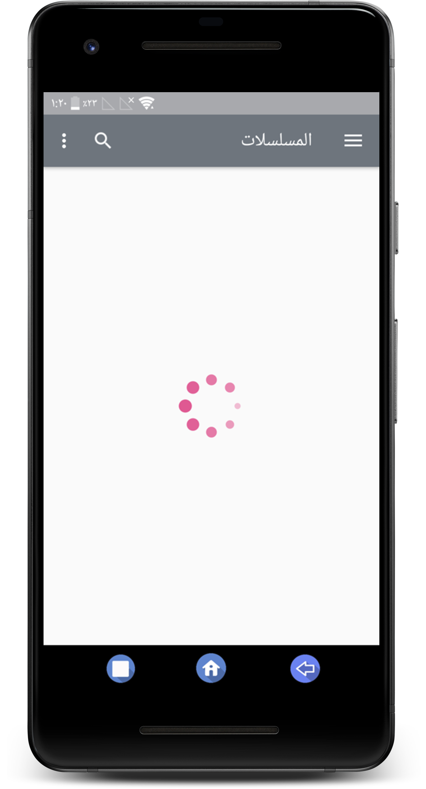

# Ottakea

Screenshots
-------------

       

## Description:
This app about displaying Korean Movies and Series Episodes.


## Libraries and Tools
- Firebase
- Picasso
- MVC Pattern
- Navigation Drawer
- Fragments and Activities
- Recycler View
- Custom Button Designed as xml
- Shared Preferences
- JSON Connection via Retrofit
- Youtube Fragment


## License

* [Apache Version 2.0](http://www.apache.org/licenses/LICENSE-2.0.html)

```
Copyright 2016 mahmoud shawara

Licensed under the Apache License, Version 2.0 (the "License");
you may not use this file except in compliance with the License.
You may obtain a copy of the License at

 http://www.apache.org/licenses/LICENSE-2.0

Unless required by applicable law or agreed to in writing, software
distributed under the License is distributed on an "AS IS" BASIS,
WITHOUT WARRANTIES OR CONDITIONS OF ANY KIND, either express or implied.
See the License for the specific language governing permissions and
limitations under the License.
```
